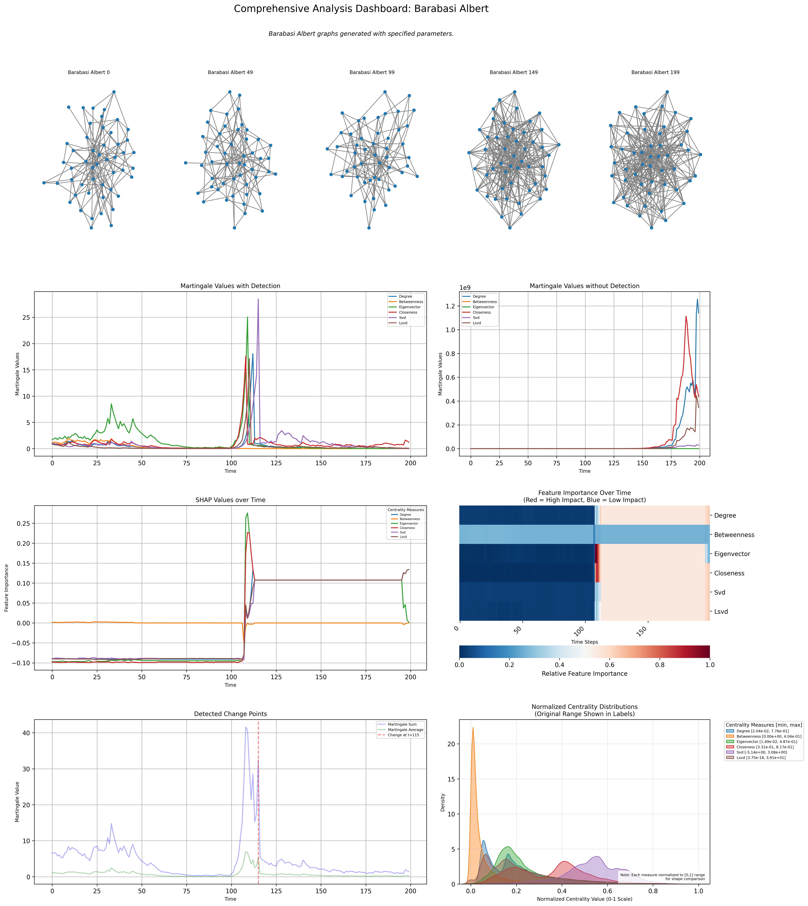

# Change Point Detection in Dynamic Networks

Detect, Predict, and Explain significant structural changes in dynamic networks using martingale-based methods and SHAP values.

## Installation

```bash
git clone https://github.com/your-repo/anomaly_detection.git
cd anomaly_detection
pip install -r requirements.txt
```

## Quick Start

Run experiments using the main CLI:

```bash
# Run synthetic data experiments
python main.py synthetic -c config/synthetic_data.yaml

# Run reality mining analysis
python main.py reality -c config/reality_mining.yaml

# Run linear model experiments
python main.py linear -c config/linear_models.yaml
```

Available experiments:
- `synthetic`: Run synthetic data experiments (requires `config/synthetic_data.yaml`)
- `reality`: Analyze Reality Mining dataset (requires `config/reality_mining.yaml`)
- `linear`: Run linear model experiments (requires `config/linear_models.yaml`)

Each experiment requires a corresponding YAML configuration file specified with the `-c` flag.

### Network Evolution Models


- Top row: Network evolution over time
- Second row: Martingale values over time (with and without detection reset*)
- Third row: SHAP values evolution with heatmap
- Fourth row: Detected change points

> \* Detection reset: After a change point is detected, the martingale values are reset to 1 until the next change point is detected. This is used to find multiple change points. If a reset is not used, the martingale values will continue to grow indefinitely.

## Module Structure

- `src/changepoint/`: Core change detection algorithms
- `src/graph/`: Graph generation and analysis
- `src/models/`: Model implementations
- `src/utils/`: Helper functions
- `experiments/`: Experiment suite

## Data Sources

- [Synthetic Graph Data](src/config/synthetic_data_config.yaml)
- [MIT Reality Mining Dataset](https://realitycommons.media.mit.edu/realitymining.html)

## References

1. Ho, S. S., et al. (2005). "A martingale framework for concept change detection in time-varying data streams." ICML.
2. Lundberg, S. M., & Lee, S. I. (2017). "A unified approach to interpreting model predictions." NeurIPS.
3. Newman, M. E. J. (2010). "Networks: An Introduction." Oxford University Press.

## Contributing

We welcome contributions to improve the project. Please see our [CONTRIBUTING.md](CONTRIBUTING.md) for guidelines.

## License

This project is licensed under the MIT License - see the [LICENSE](LICENSE) file for details.