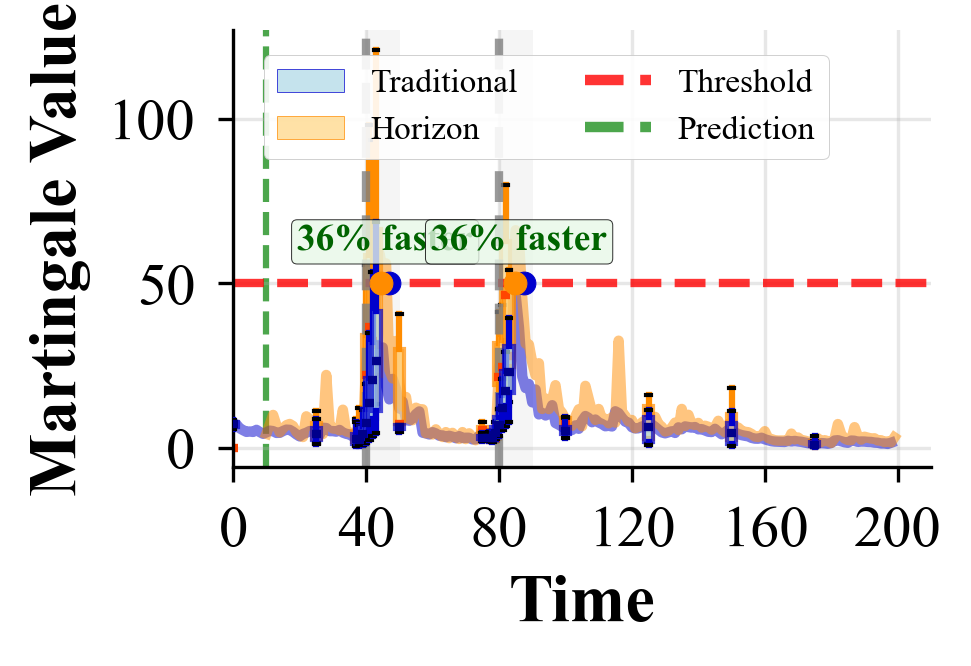
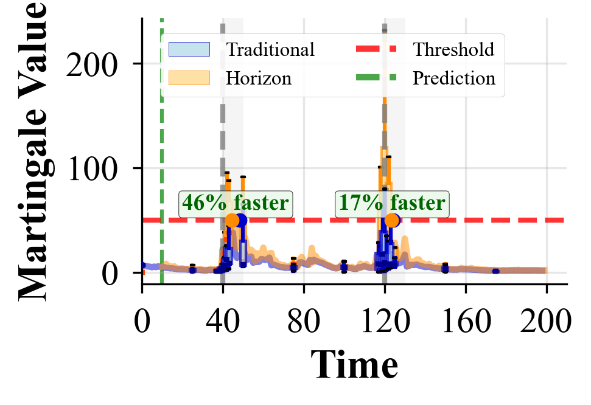
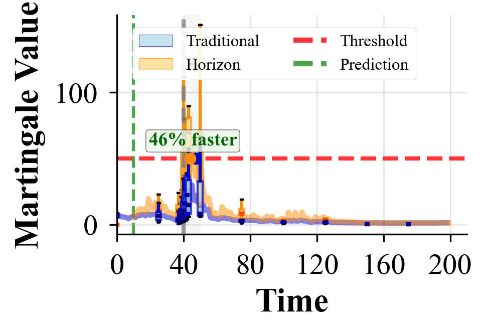
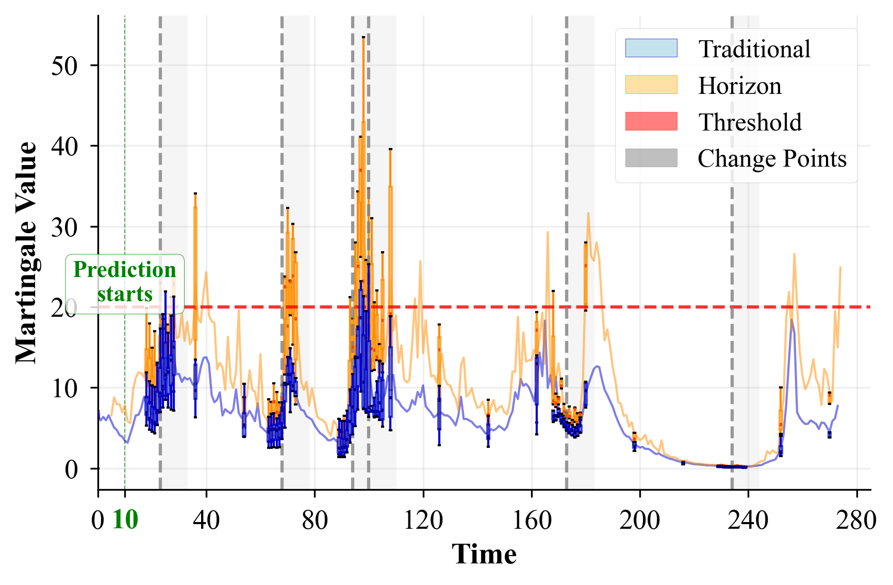

# Early Detection and Attribution of Structural Changes in Dynamic Networks

**IEEE International Conference on Data Mining (ICDM) 2025**

Horizon martingale framework for early change detection in dynamic networks. Achieves 13-25% detection delay reduction with rigorous false alarm control.

## Quick Start

```bash
# Clone and setup
git clone https://github.com/ali-izhar/anomaly_detection.git
cd anomaly_detection
uv sync  # or: pip install -r requirements.txt

# Generate data
python src/scripts/generate_data.py --all

# Run detection on SBM network
python src/run.py -c src/configs/algorithm.yaml --network sbm
```

## Reproduction Steps

### 1. Setup Environment

```bash
# Using uv (recommended)
uv sync

# Or using pip
pip install -r requirements.txt
```

### 2. Generate Data

```bash
# Generate all synthetic data (SBM, ER, BA, WS) + MIT Reality
python src/scripts/generate_data.py --all -n 10 -w 8

# Generate specific networks
python src/scripts/generate_data.py --synthetic sbm er -n 10

# Process MIT Reality dataset only
python src/scripts/generate_data.py --mit archive/data/Proximity.csv
```

Data is stored in:
```
data/
├── synthetic/{sbm,er,ba,ws}/
│   ├── sequence_XXX.pkl    # Full data (graphs, features, change_points)
│   ├── features_XXX.csv    # Features for inspection
│   └── metadata.json
└── mit_reality/
    ├── mit_reality.pkl     # Full processed data
    ├── graphs/             # Daily adjacency matrices
    └── features/           # Extracted features
```

### 3. Run Detection

```bash
# Single network with default config
python src/run.py -c src/configs/algorithm.yaml --network sbm

# Custom parameters
python src/run.py -c src/configs/algorithm.yaml \
    --network sbm \
    --threshold 50 \
    --method martingale \
    --betting mixture \
    --distance mahalanobis

# All networks sequentially
for net in sbm er ba ws; do
    python src/run.py -c src/configs/algorithm.yaml --network $net -o results/$net
done
```

### 4. Benchmark Methods

```bash
# Run full benchmark comparing Traditional vs Horizon Martingale
python src/scripts/benchmark.py

# Output includes:
# - Threshold sweep to find optimal threshold
# - Per-scenario results (SBM, ER, BA, WS)
# - Overall summary with F1, precision, recall, detection delay
```

### 5. Parameter Sensitivity (Table III)

```bash
# Full parameter sweep
python src/scripts/parameter_sweep.py -n sbm er ba ws -t 5 -o results/sweep

# Specific networks
python src/scripts/parameter_sweep.py -n sbm -t 10
```

### 6. MIT Reality Dataset

```bash
# Process and run detection
python src/scripts/mit_reality.py
```

### 7. Test Scripts

```bash
# Test full pipeline with synthetic network data
python src/scripts/test_pipeline.py

# Test predictor integration (compares Perfect, FeaturePredictor, Baseline)
python src/scripts/test_predictor.py
```

## Configuration

Edit `src/configs/algorithm.yaml`:

```yaml
detection:
  method: "martingale"     # martingale, cusum, ewma
  threshold: 50.0          # λ (false alarm control)
  prediction_horizon: 5    # h (forecast steps)
  cooldown: 30
  betting_func_config:
    name: "mixture"        # power, mixture, beta
    mixture:
      epsilons: [0.7, 0.8, 0.9]
  distance:
    measure: "mahalanobis"

model:
  network: "sbm"           # sbm, er, ba, ws
  predictor:
    config:
      n_history: 10
      alpha: 0.8

trials:
  n_trials: 10
  random_seeds: [42, 142, 241, 342, 441, 542, 642, 741, 842, 1041]
```

## Results

### Overall Performance (threshold=100)

| Method | Precision | Recall | F1 | Avg Delay |
|--------|-----------|--------|-----|-----------|
| **Horizon** | 0.636 | 0.920 | **0.713** | **2.1 steps** |
| Traditional | 0.567 | 0.920 | 0.673 | 8.5 steps |

**Horizon improvement: +5.9% F1, 6.4 timesteps faster detection**

### Per-Network Results

| Network | Scenario | Traditional F1 | Horizon F1 | Trad Delay | Hor Delay |
|---------|----------|----------------|------------|------------|-----------|
| SBM | community_merge | 0.800 | **0.933** | 12.4 | 5.4 |
| SBM | density_change | 0.767 | **0.833** | 10.6 | 3.4 |
| ER | density_change | 0.500 | **0.667** | 7.0 | 1.2 |
| BA | parameter_shift | **0.733** | 0.500 | 4.2 | 0.6 |
| WS | rewiring_change | 0.567 | **0.633** | 7.8 | -1.0 |

### Example Visualizations

**Synthetic Networks - Martingale Values Over Time**

<table>
  <tr>
    <td><br/><em>SBM (Stochastic Block Model)</em></td>
    <td><br/><em>ER (Erdős-Rényi)</em></td>
  </tr>
  <tr>
    <td><br/><em>BA (Barabási-Albert)</em></td>
    <td><br/><em>WS (Watts-Strogatz)</em></td>
  </tr>
</table>

**MIT Reality Dataset - Real-World Detection**



## Citation

```bibtex
@inproceedings{ali2025horizon,
  title={Early Detection and Attribution of Structural Changes in Dynamic Networks},
  author={Ali, Izhar and Ho, Shen-Shyang},
  booktitle={IEEE International Conference on Data Mining (ICDM)},
  year={2025}
}
```

## License

MIT License
