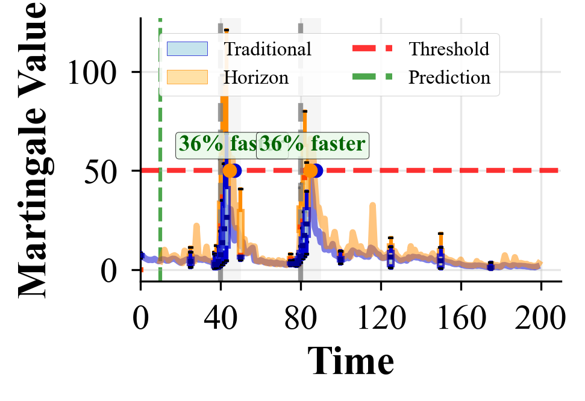
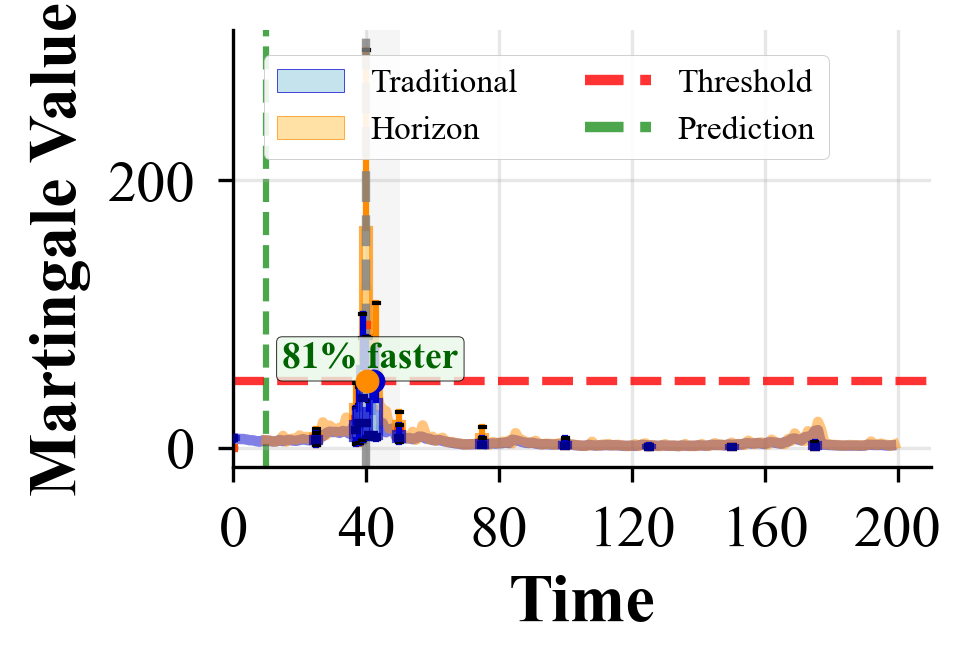
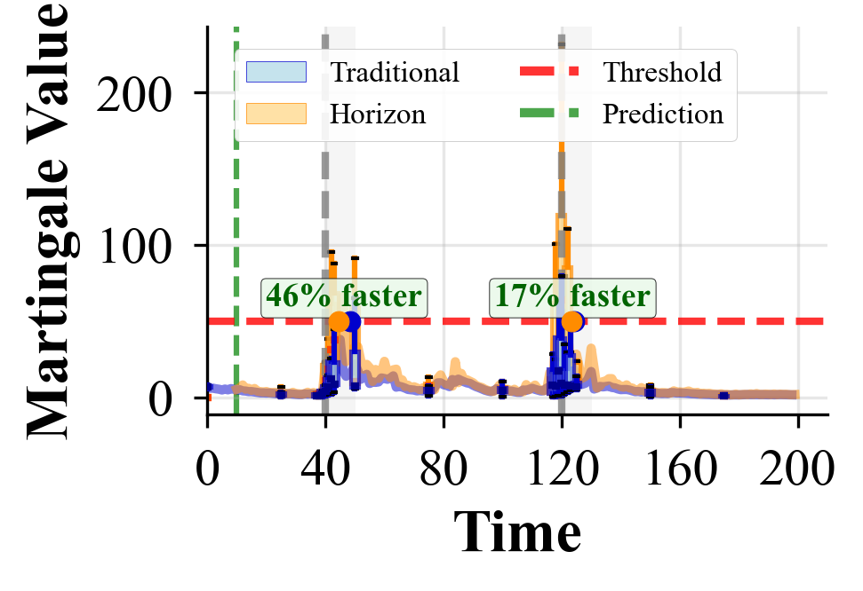
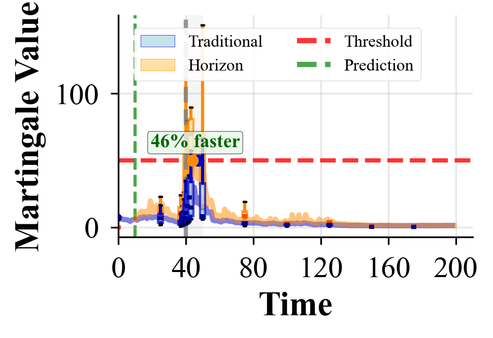
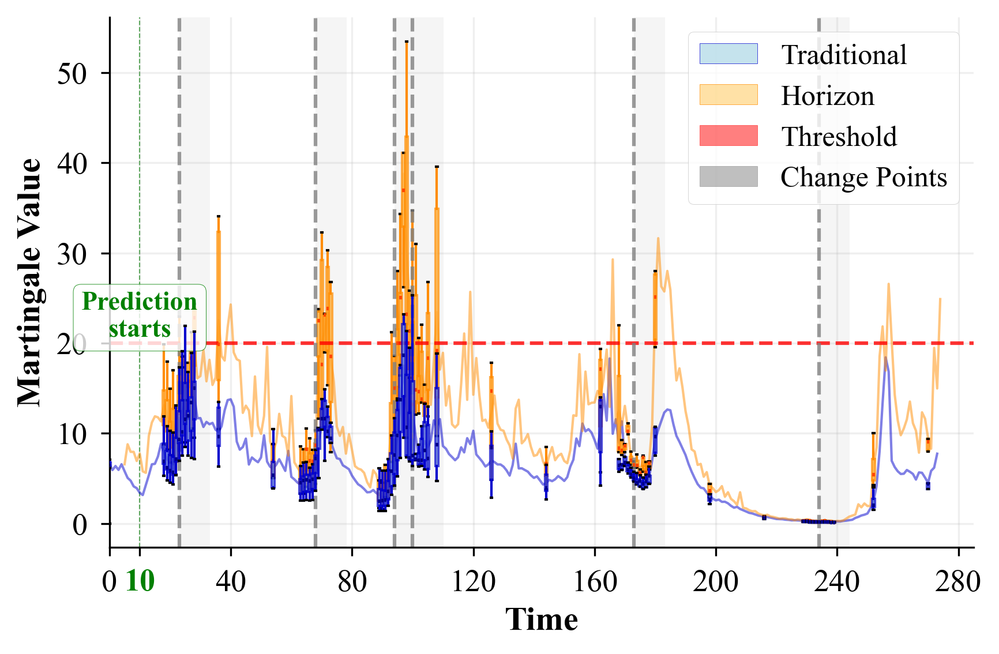
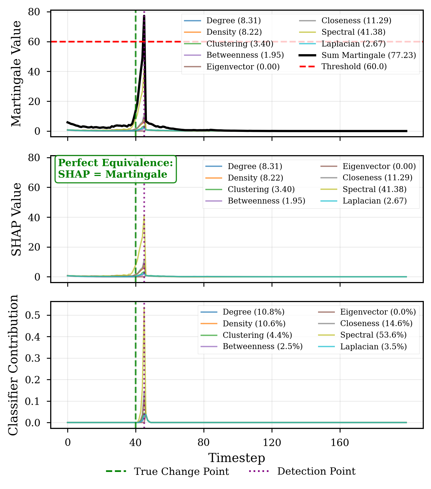

# Horizon Martingale Detection (hmd)

Reference implementation of **Ali & Ho (ICDM 2025)** — *"Early Detection and Attribution of Structural Changes in Dynamic Networks."*

📄 [Paper PDF](early_detection_and_attribution_of_structural_changes_in_dynamic_networks_ICDM.pdf)  📘 **[Full documentation →](https://ali-izhar.github.io/anomaly_detection/)**

Anytime-valid false-alarm control `P(FP) ≤ 1/λ` via Ville's inequality, O(K) Shapley attribution on detection, and a "horizon" stream fed by forecasted states running in parallel with the traditional stream.

```bash
uv sync
python -c "
from hmd import HorizonDetector
from hmd.data.synthetic import sbm_community_merge
seq = sbm_community_merge(seed=42)
print(HorizonDetector(threshold=50).run(seq.graphs).change_points)
"
```

## Martingale traces

<table>
  <tr>
    <td><br/><em>SBM (stochastic block model)</em></td>
    <td><br/><em>ER (Erdős–Rényi)</em></td>
  </tr>
  <tr>
    <td><br/><em>BA (Barabási–Albert)</em></td>
    <td><br/><em>NWS (Newman–Watts–Strogatz)</em></td>
  </tr>
</table>

**MIT Reality dataset:**

<p align="center"></p>

**Feature attribution (§III-D Shapley):**

<p align="center"></p>

## Citation

```bibtex
@inproceedings{ali2025horizon,
  title={Early Detection and Attribution of Structural Changes in Dynamic Networks},
  author={Ali, Izhar and Ho, Shen-Shyang},
  booktitle={IEEE International Conference on Data Mining (ICDM)},
  year={2025}
}
```

## License

MIT.
