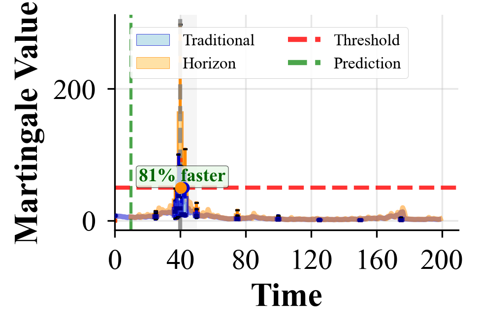

# Early Detection and Attribution of Structural Changes in Dynamic Networks

**Accepted at [IEEE International Conference on Data Mining (ICDM) 2025](https://www3.cs.stonybrook.edu/~icdm2025/index.html)**  
*DOI and publication link coming soon*

Implementation of the horizon martingale framework for early change detection in dynamic networks.

## Overview

This repository implements **horizon martingales** that leverage statistical forecasting to detect structural changes in dynamic networks before they fully manifest. The framework achieves 13-25% reduction in detection delay while maintaining rigorous false alarm control. For complete technical details, please refer to the **[documentation](DOCS.md)** file.

**Key Features:**
- Early detection through predictive evidence accumulation
- Exact feature attribution via Martingale-Shapley equivalence  
- Multiple network models (SBM, BA, ER, NWS) and real-world data support

## Quick Start

```bash
git clone https://github.com/ali-izhar/anomaly_detection.git
cd anomaly_detection
pip install -r requirements.txt

# Run basic detection
python src/run.py -c src/configs/algorithm.yaml

# Run with custom parameters
python src/run.py -c src/configs/algorithm.yaml --network sbm --threshold 50
```

## Key Results

The framework demonstrates consistent early detection across network types:

### MIT Reality Dataset

*Horizon martingales (orange) achieve 22% delay reduction over traditional martingales (blue) for academic event detection, with TPR improvement from 88% to 96%.*

### Synthetic Network Performance  

| SBM (36% faster) | ER (81% faster) |
|:---:|:---:|
|  |  |
| **BA (46%/17% faster)** | **NWS (46% faster)** |
|  |  |

*Horizon martingales consistently outperform traditional detection across all network types.*

### Feature Attribution Analysis

*Demonstration of perfect equivalence (R² = 1.0000) between SHAP values and martingale values, with spectral features contributing 53.6% to detection.*

## Citation

```bibtex
@inproceedings{ali2025horizon,
  title={Early Detection and Attribution of Structural Changes in Dynamic Networks},
  author={Ali, Izhar and Ho, Shen-Shyang},
  booktitle={IEEE International Conference on Data Mining (ICDM)},
  year={2025}
}
```

## License

MIT License - see [LICENSE](LICENSE) for details.