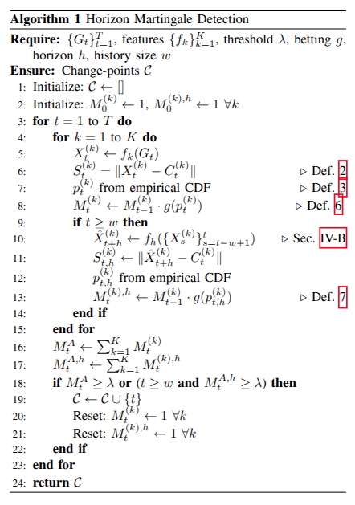

# Algorithm 1

Algorithm 1 is the orchestration. `hmd.HorizonDetector.run_on_features` implements all 24 lines line-for-line.

## Pseudocode ↔ code mapping

| Alg 1 line | Does | `hmd/` location |
|---|---|---|
| 1–2 | initialize `C`, `M_0^(k) = M_0^(k,h) = 1` | `detector.py` — `logM_trad_pf`, `logM_hrzn_pf = zeros(K)` |
| 5 | `X_t^(k) ← f_k(G_t)` | `features.extract_sequence` precomputed; detector slices |
| 6 | `S_t^(k) = \|X_t − C_t\|` | `C_t = X[:t].mean(axis=0)`; `S_t_pf = abs(x_t − C_t)` |
| 7 | p-value from empirical CDF (Def 3) | `conformal.smoothed_pvalue_step` |
| 8 | `M_t^(k) ← M_{t−1}^(k) · g(p_t^(k))` | `martingale.update_traditional` (log-space) |
| 9 | gate `t ≥ w` for horizon stream | `if cfg.enable_horizon and t >= w` |
| 10 | forecast `X̂_{t+h}` from window | `cfg.forecaster.predict_multi(hist_window, horizon=h)` |
| 11 | `S_{t,h}^(k) = \|X̂ − C_t\|` | `S_pred_pf = abs(X_hat − C_t_full)` |
| 12 | predictive p-value (Eq 10) | `conformal.predictive_pvalue_step` |
| 13 | `M_t^(k,h) ← M_{t−1}^(k,h) · g(p_{t,h}^(k))` | `martingale.update_traditional` on horizon accumulator |
| 16–17 | `M_t^A = Σ_k M_t^(k)`, `M_t^{A,h} = Σ_k M_t^(k,h)` | `_logsumexp` per stream |
| 18 | `if M_t^A ≥ λ or M_t^{A,h} ≥ λ` | `logM_sum_trad[t] ≥ log_lam` OR horizon equivalent |
| 19–21 | append `t` to `C`, reset both streams to 1 | `logM_trad_pf[:] = 0`, `logM_hrzn_pf[:] = 0` |
| 24 | `return C` | `DetectionResult.change_points` |

## Implementation knobs beyond the paper

| Knob | Default | Why (not in paper) |
|---|---|---|
| `startup_period` | 20 | Running-centroid SE is unstable for small t; matches paper's own `w_cal = 0.1T = 20` |
| `cooldown` | 20 | Matches eval window Δ=20; prevents consecutive-step re-triggers from same change |
| `horizon_weights` | None | Enables Vovk-Wang multi-horizon mixture |
| `normalize_features` | False | Optional z-score using calibration-window stats |
| `detection_mode` | `"per_feature"` | `"joint"` uses the Mahalanobis path implied by Table III's distance-metric sweep |

See [design/choices](design/choices.md) for full rationale.
