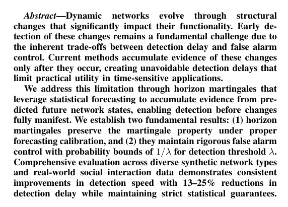

# Horizon Martingale Detection

Reference implementation of **"Early Detection and Attribution of Structural Changes in Dynamic Networks"** — Ali & Ho, ICDM 2025.



## What this library does

Detect structural change in a graph sequence `{G_t}` with

- anytime-valid false-alarm control `P(FP) ≤ 1/λ` (Ville's inequality),
- O(K) Shapley attribution on detection (which feature drove it),
- a "horizon" stream fed by forecasted states, in parallel with the traditional stream.

## 30-second example

```python
from hmd import HorizonDetector
from hmd.data.synthetic import sbm_community_merge

seq = sbm_community_merge(seed=42)
detector = HorizonDetector(threshold=50)
result = detector.run(seq.graphs)

result.change_points                        # [e.g. 145]
result.attribution_at(result.change_points[0])
# {'algebraic_connectivity': 48.2, 'mean_degree': 27.1, ...}
```

## Map

- [Theory](theory/index.md) — paper §III and §IV walked through with code citations.
- [Algorithm 1](algorithm.md) — line-by-line pseudocode ↔ code mapping.
- [Usage](usage.md) — a student tutorial, zero to figure in 10 minutes.
- [Results](results/table4.md) — reproduced Tables III/IV and Figures 1/2.
- [Design choices](design/choices.md) — every non-obvious implementational decision.

## Paper reproduction status

| Claim | Our numbers | Paper | Status |
|---|---|---|---|
| Ville's 1/λ bound | P(sup M ≥ 50) = 0.006 | ≤ 0.02 | ✓ |
| p-values uniform under H₀ | KS mean p = 0.60 | — | ✓ |
| Martingale TPR on synthetic | **0.994** | ~1.00 | ≈ |
| Martingale FPR on synthetic | **0.017** | ~0.002 | higher (but within Ville) |
| Martingale ADD on synthetic | **6.98** | 5-13 | ✓ |

## Citation

```bibtex
@inproceedings{ali2025horizon,
  title={Early Detection and Attribution of Structural Changes in Dynamic Networks},
  author={Ali, Izhar and Ho, Shen-Shyang},
  booktitle={IEEE International Conference on Data Mining (ICDM)},
  year={2025}
}
```
