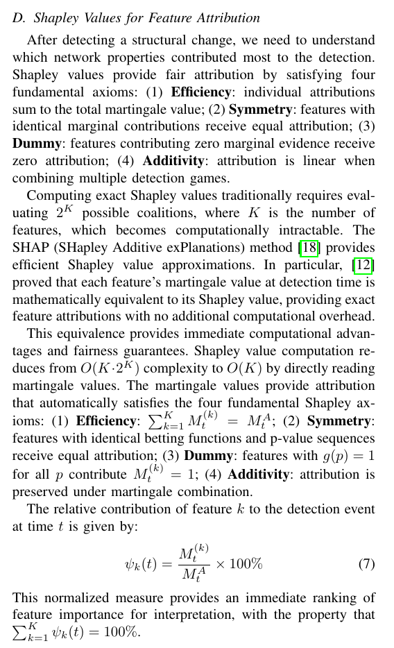

# §III-D — Attribution via Martingale-Shapley equivalence

Ho et al. [12] prove that each feature's martingale value IS its Shapley value for the additive game `v(S) = Σ_{k∈S} M_t^(k)`, reducing a 2^K coalition enumeration to O(K).

$$\psi_k(t) = \frac{M_t^{(k)}}{M_t^A} \times 100\%$$

Four Shapley axioms hold by construction:

- **Efficiency**: `Σ_k ψ_k = 100%`.
- **Symmetry**: identical betting trajectories → identical ψ.
- **Dummy**: `g(p_s) ≡ 1` → M_k = 1 → ψ_k shrinks relative to active features.
- **Additivity**: sum-of-martingales is linear in per-feature games.

Computed in log-space to avoid overflow at high scores:

$$\psi_k = \exp\left(\log M_t^{(k)} - \mathrm{logsumexp}(\log M_t)\right) \times 100$$

Implementation: `hmd.attribution.shapley_values`, `hmd.attribution.dominant_driver`.

At `t=0` and just after a reset, all `M^(k) = 1` → equal shares `100/K` per feature (correct limit).
