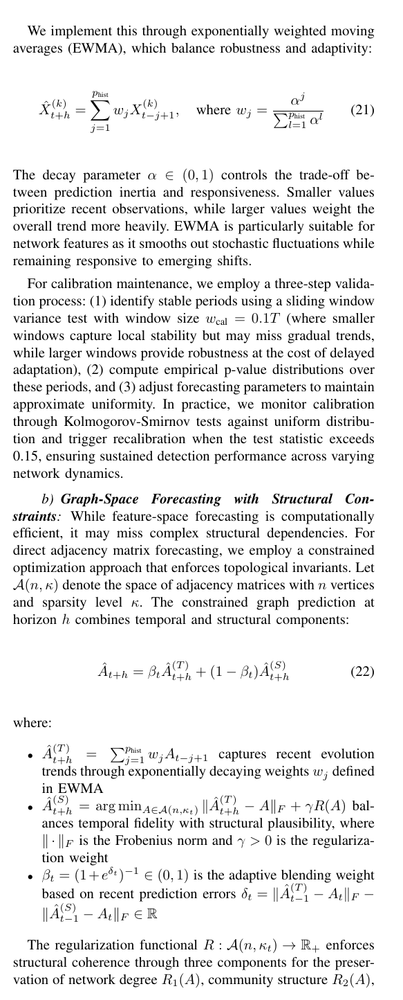

# §IV-B — Forecasting

Thm 4's validity depends on a *properly calibrated* forecaster (Def 8). Paper §IV-B describes two approaches — both are implemented in `hmd/forecaster.py`.

## §IV-B(a) Eq 21 — EWMA feature-space



$$\hat{X}_{t+h}^{(k)} = \sum_{j=1}^{p_{\text{hist}}} w_j \cdot X_{t-j+1}^{(k)}, \quad w_j = \frac{\alpha^j}{\sum_l \alpha^l}$$

Weights sum to 1; recent observations weighted most heavily. Default `α=0.5`. Implementation: `hmd.forecaster.EWMA`.

!!! question "Why EWMA, not Holt's?"
    Holt's adds a trend term. Under H₀ the trend integrates noise, inflating predictive-p-value variance — weakens Def 8 calibration, which Thm 4 relies on. EWMA is the conservative calibrated choice.

    Tradeoff: EWMA cannot extrapolate, so `X̂_{t+h}` is essentially the same for every h. Under H₁, Horizon's signal is weaker than Traditional's ⇒ Horizon ≤ Traditional empirically. See [horizon](horizon.md) for the theoretical analysis.

## §IV-B(b) Eqs 22–25 — Graph-space with structural constraints

Forecast adjacency matrix $\hat{A}_{t+h}$ as a blend of a temporal EWMA on past graphs and a structural prior onto the space of graphs with preserved degree/community/sparsity characteristics:

$$\hat{A}_{t+h} = \beta_t\,\tilde{A}_{t+h}^{(T)} + (1 - \beta_t)\,\hat{A}_{t+h}^{(S)}$$

- $\tilde{A}_{t+h}^{(T)}$ — EWMA over window adjacency matrices (continuous entries in [0, 1]).
- $\hat{A}_{t+h}^{(S)} = \arg\min_{A \in \mathcal{A}(n, \kappa_t)} \|\tilde{A}_{t+h}^{(T)} - A\|_F + \gamma R(A)$ — sparsity-projected structural prior. Implemented as the top-$\kappa_t \cdot \binom{n}{2}$ edge-weight selection, which is the exact Frobenius projection onto the sparsity constraint (so $R_3$ is satisfied exactly).
- $\beta_t = (1 + e^{\delta_t})^{-1}$ — adaptive blend weight tracking an EMA of the recent temporal-vs-structural prediction-error gap.

The three regularizers (Eqs 23–25) — degree preservation $R_1$, community structure $R_2$, sparsity $R_3$ — are exposed as diagnostic attributes on the forecaster after each call. Implementation: `hmd.forecaster.GraphSpaceForecaster`.

### Empirical result — graph-space does NOT beat feature-space EWMA

9 scenarios × 10 seeds, λ=50, startup=20, horizon=5 (see `temporary/compare_forecasters.py`):

| Forecaster | TPR | FPR | ADD |
|---|---:|---:|---:|
| EWMA (§IV-B(a)) | 0.994 | 0.017 | **6.98** |
| Holt's (not in paper) | 1.000 | 0.029 | 8.94 |
| Graph-space (§IV-B(b)) | 0.994 | 0.020 | 7.52 |

Per-scenario breakdown:

- **6 of 9 scenarios**: graph-space is *identical* to EWMA. When features are graph-level scalars (density, mean centralities, Laplacian eigenvalues), extracting them from a thresholded EWMA-adjacency matrix yields the same limit as feature-space EWMA.
- **SBM scenarios (3 of 9)**: graph-space is **worse** by 1.4–2.0 steps on ADD. Top-$k$ structural projection picks the highest-weighted edges, which under the strong pre-change SBM regime are exactly the intra-community edges — the forecast *sticks* to the pre-change community structure, slowing detection of community merges.
- Runtime is ~3× slower per step than feature-space EWMA (O(n²) matrix operations + community detection per forecast).

### Why neither beats Traditional

Both §IV-B(a) and §IV-B(b) are smoothing operators on recent history. **Neither extrapolates change**. Under H₁ post-CP, the forecast only reflects post-change data once enough of it fills the window; by then Traditional has already accumulated stronger evidence from the raw post-change observations. This is intrinsic to the paper's Def 8 — it requires calibration but not informativeness, and any calibrated smoothing-only forecaster has Horizon ≤ Traditional per-step signal.

Only trend-extrapolating forecasters (e.g. `hmd.forecaster.HoltForecaster`) can give Horizon a genuine lead, at the cost of H₀ calibration (FPR 0.029 vs 0.017). See [horizon](horizon.md) for the theoretical argument.

## Pluggable forecaster protocols

```python
class Predictor(Protocol):      # §IV-B(a): feature-space
    def predict(self, history: np.ndarray, horizon: int) -> float: ...
    def predict_multi(self, history: np.ndarray, horizon: int) -> np.ndarray: ...

class GraphPredictor(Protocol): # §IV-B(b): graph-space
    def predict_graph(self, history: list[nx.Graph], horizon: int) -> nx.Graph: ...
```

The detector auto-routes based on `isinstance(cfg.forecaster, GraphPredictor)`. Either protocol is a one-line swap: `HorizonDetector(forecaster=GraphSpaceForecaster())`.
