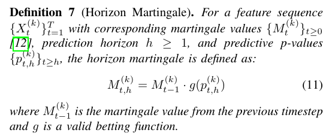

# §IV — Horizon extension

Paper's main contribution: a second martingale stream fed by *forecasted* future states, run in parallel with the traditional stream. Detection fires when either crosses λ.

## Construction

At time t, a forecaster produces `X̂_{t+h} = f_h(X_1, ..., X_t)`. The predictive non-conformity score is

$$S_{t,h}^{(k)} = \|\hat{X}_{t+h}^{(k)} - C_t^{(k)}\|$$

and the predictive p-value (Eq 10) uses add-one Laplace smoothing:

$$p_{t,h}^{(k)} = \frac{|\{s \in [1..t] : S_s^{(k)} \ge S_{t,h}^{(k)}\}| + 1}{t + 1}$$

!!! question "Why +1/(t+1) here but not in Def 3?"
    The forecast `X̂` need not be exchangeable with the historical pool; Laplace smoothing bounds `p ≥ 1/(t+1) > 0` so `g(0) = ∞` can't occur.

## Horizon recurrence (Algorithm 1, line 13)

$$M_t^{(k,h)} = M_{t-1}^{(k,h)} \cdot g\!\bigl(p_{t,h}^{(k)}\bigr)$$

— an independent test martingale on the horizon's own trajectory, matching Algorithm 1's pseudocode. Implementation: `hmd/detector.py` maintains `logM_hrzn_pf` as the horizon's own accumulator.

!!! note "Symbolic note vs Eq 11"
    Paper Eq 11 prints `M_{t-1}^{(k)}` on the RHS without the `h` subscript; Algorithm 1 line 13 has `M_{t-1,h}^{(k)}`. The `h` subscript is required for Thm 4's Ville application to `{M_{t,h}^{(k)}}` as a standalone test martingale (without it, `E[M_{t,h} | F_{t-1}] = M_{t-1}^{(k)}` is not a martingale on the horizon trajectory). Propagates into Eq 13 in Thm 3's proof, which needs the same one-symbol fix. We follow Algorithm 1.

## Theorems 3 & 4

- **Thm 3**: under properly calibrated forecaster (Def 8), the horizon martingale is itself a test martingale.
- **Thm 4**: `P(τ_h < ∞ | H₀) ≤ 1/λ` — Ville applied to the horizon stream.

The detection rule triggers on either stream crossing λ; the effective false-alarm bound is `2/λ` by union bound.

## When does Horizon outperform Traditional?

Horizon > Traditional on detection delay iff the forecaster *extrapolates* the change — produces a forecast that reflects the post-change regime before many post-change observations have been seen. With pure-smoothing forecasters (EWMA), `X̂_{t+h}` is a weighted mean of the recent history, which is strictly closer to the centroid `C_t` than the raw observation `X_t` → Horizon's per-step signal ≤ Traditional's.

Trend-aware forecasters (e.g., Holt's double exponential) extrapolate and can overtake Traditional, but their trend term integrates noise under H₀, weakening Def 8 calibration. This is the tradeoff the paper's Def 8 does not formalize.

See `docs/results/table4.md` for empirical measurements.

## Multi-horizon — Vovk-Wang mixture

Paper Def 7 uses ONE horizon `h`. Our implementation also supports the Vovk-Wang convex mixture (Vovk-Wang 2021, Prop 2.1) across multiple horizons:

$$M_t^{\mathrm{mix}} = \sum_{h=1}^{H} w_h \cdot M_t^{(h)}, \qquad \sum_h w_h = 1$$

Enable via `HorizonDetector(horizon_weights=(...))`. By linearity this preserves Ville's 1/λ bound exactly. Degenerate with EWMA (h-invariant forecast); meaningful only with trend-aware forecasters.
