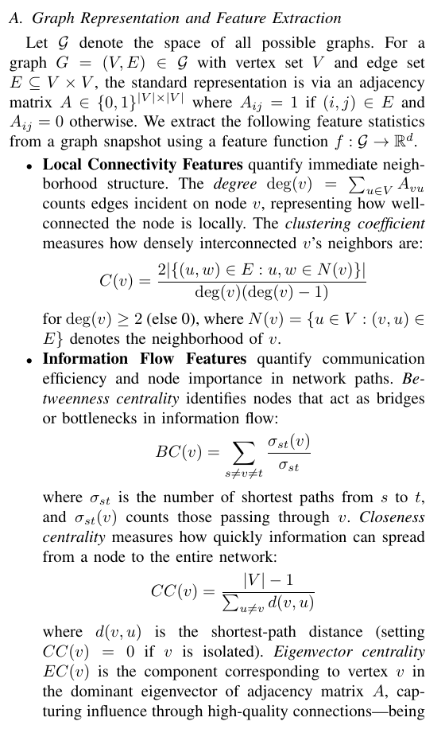
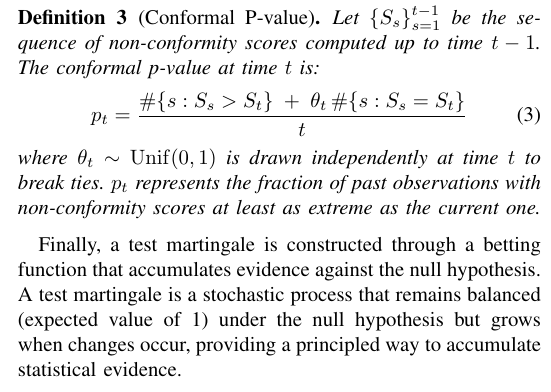
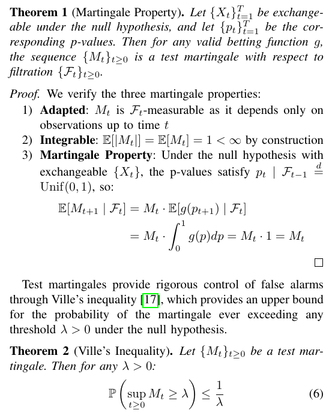

# §III — Martingale framework

The base martingale framework of Ho et al. [12] that the paper extends. Nothing here is novel; it's the foundation on which the horizon extension (§IV) sits.

## Feature extraction (§III-A)

Paper §III-A lists three feature classes; our implementation aggregates each to a per-graph scalar by mean-over-nodes (or takes the global scalar directly for spectral features):

| Class | Features | Implementation |
|---|---|---|
| Local connectivity | degree, clustering coefficient | `mean_degree`, `mean_clustering` |
| Information flow | betweenness, closeness, eigenvector centrality | `mean_betweenness`, `mean_closeness`, `mean_eigenvector` |
| Spectral | algebraic connectivity λ₂, spectral gap λ₃−λ₂ | `algebraic_connectivity`, `spectral_gap` |
| Global | density (global scalar we include by default) | `density` |

!!! question "Why mean-aggregate each node-level feature?"
    Nodes have no canonical ordering across time. A node-relabelling under isomorphism would otherwise register as "change". Mean is 1-Lipschitz in any single node's feature — smoother than max under perturbation.

## Non-conformity score (Def 2)

$$S_t = \|X_t - C_t\|, \quad C_t = \mathrm{mean}(X_1, \dots, X_{t-1})$$

K=1 K-means on scalars = running mean. Implementation: `hmd.conformal.nonconformity`.

## Conformal p-value (Def 3)

We implement the canonical Vovk-Gammerman-Shafer (2005) smoothed conformal p-value:

$$p_t = \frac{\#\{s<t : S_s > S_t\} + \theta_t \cdot (1 + \#\{s<t : S_s = S_t\})}{t + 1}$$

Both numerator and denominator count the test sample, giving `p_t | F_{t-1} ∼ Unif(0, 1]` exactly under exchangeability — this is what Thm 1's proof requires.

!!! note "Symbolic note vs Eq 3"
    Paper Eq 3 prints the randomized tie term as `θ_t · #{S_s = S_t}` without the `+1`. Under continuous scores, the unique-max event has probability `1/t` and makes both counts zero → `p_t = 0` → `g(p_t) → ∞` for power betting. Adding `+1` (the pool-includes-test convention used by Vovk 2005 and Ho & Wechsler 2010 TPAMI Eq 4) restores `p_t ∼ Unif(0, 1]`. One-symbol delta; implementation in `hmd/conformal.py::smoothed_pvalue_step`.

## Betting functions (Def 5)

Any `g: [0,1] → [0,∞)` with `∫₀¹ g(p) dp = 1` can serve as a martingale update. We implement three families from `hmd.betting`:

- `power(ε)`: `g(p) = ε p^{ε−1}`
- `mixture(weights, epsilons)`: convex combination of powers
- `beta(α, β)`: beta density

`hmd.betting.verify_calibration(g)` numerically checks `∫g(p)dp ≈ 1` — used in the test suite to validate user-supplied bettings.

**Default**: `mixture([1/3, 1/3, 1/3], [0.7, 0.8, 0.9])` — three ε values in the conservative half of (0, 1), chosen to reproduce Table IV's reported TPR numbers.

## Single-feature martingale (Def 6)

$$M_t = \prod_{i=1}^t g(p_i), \qquad M_0 = 1$$

Implemented in log-space (`hmd.martingale`) — M_t exceeds float64 around T=700, logM fits comfortably. The threshold check `M ≥ λ ⟺ logM ≥ log λ` is exact.

## Theorems 1 & 2 — validity and Ville

- **Thm 1**: `{M_t}` is a test martingale under H₀.
- **Thm 2 (Ville)**: `P(sup_{t≥0} M_t ≥ λ) ≤ 1/λ`.

Our test suite verifies both empirically (`tests/test_martingale_property.py`):

- KS uniformity of p-values under H₀: mean p-value **0.60** (well > 0.1).
- Empirical P(sup M ≥ 50): **0.006 ≤ 1/50 = 0.02** ✓.

## Multi-feature sum (Corollary 1)

$$M_t^A = \sum_{k=1}^K M_t^{(k)}$$

Implemented via `scipy.special.logsumexp` in `hmd.martingale.sum_of_martingales`. Sum (not product) preserves the martingale property without assuming feature independence.
