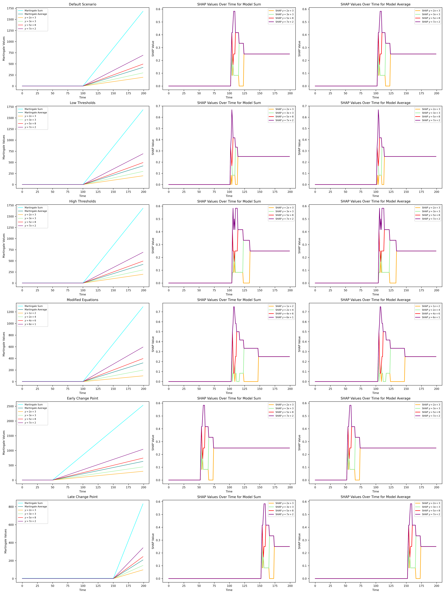

<i>This document outlines the intuition and design of the experiments located in the `tests` directory.</i>

# 1. Linear Models Experiment

The Linear Models Experiment is designed to detect and explain structural changes in time series data using linear equations combined with martingale frameworks.

## 1.1 Linear Equations Setup

From `config/linear_models.yaml`, the following equations serve as the baseline models before and after the change point, enabling the detection of structural shifts in the data.

```yaml
equations:
  default:              
    - [2, 3]            # y = 2x + 3
    - [3, 3]            # y = 3x + 3
    - [5, 8]            # y = 5x + 8
    - [7, 2]            # y = 7x + 2
```

## 1.2 Martingale Framework

From `tests/linear_models.py`:

```python
# Before change point (t ≤ change_point): M(t) = 1
# After change point: M(t) = mx + b - (m * change_point + b)
```

This design intentionally creates a stable baseline $(M(t) = 1)$ before the change point and allows the martingale values to follow the defined linear equations post-change. This clear distinction aids in visually and statistically identifying changes in the time series.

## 1.3 Experiment Dashboard

<!--  -->

- **Default Scenario (Row 1):** Martingale values remain constant at $1$ before the change point $(t=100)$ and follow the actual linear equations thereafter. Consequently, SHAP values exhibit a spike at the change point, indicating the detection moment.
- **Detection Thresholds (Row 2):** Adjusting detection thresholds impacts the sensitivity and stability of change detection:
  - **Low Thresholds:** Lower thresholds enable earlier detection with higher sensitivity but introduce more noise in SHAP values, resulting in jagged spikes and a less stable post-detection plateau.

  ```yaml
  low_threshold:
    thresholds:
      sum: 30
      avg: 7.5
  ```

  - **High Thresholds:** Higher thresholds delay detection but provide cleaner and more decisive SHAP spikes, smoother transitions, and a more stable plateau after detection.

  ```yaml
  high_threshold:
    thresholds:
      sum: 70
      avg: 17.5
  ```

  - **Visual Pattern Comparison:**

  ```text
    Low Threshold:  ___/\/\___  (Earlier, noisier)
    High Threshold: ____/‾\___  (Later, cleaner)
  ```

- **Modified Equations (Row 4):** This setup tests the robustness of change detection across different equation sets, ensuring the framework's adaptability to varied linear relationships.

  ```yaml
  modified:
    equations: "modified"
    - [1, 2]
    - [2, 4]
    - [4, 6]
    - [6, 1]
  ```

  - **Time Variation (Rows 5-6):** The experiment includes scenarios with early $(t=50)$ and late $(t=150)$ change points, demonstrating the framework's ability to consistently detect changes regardless of their timing within the series.


## 1.4 SHAP Value Interpretation

SHAP values are computed to interpret the model's detections, providing insights into feature contributions during change detection. From `linear_models.py`:

```python
def compute_shap_values(model, background, X_explain):
    """Compute SHAP values for model interpretability.
    Uses KernelExplainer to compute Shapley values:
    phi_i = sum_S (1 - |S| / n) * (f(x_S + i) - f(x_S))
    """
```

The SHAP value patterns observed include:

- **Pre-change Point:** SHAP values remain flat, indicating stable model behavior.
- **Change Point:** A spike in SHAP values signals the detection of a structural change.
- **Post-change Point:** SHAP values stabilize, reflecting the new normal state of the model.


## 1.5 Running the Experiment

```python
python main.py linear -c config/linear_models.yaml
```

---

# 2. Synthetic Network Experiments

The Synthetic Network Experiments are designed to generate and analyze evolving networks with controlled structural changes. These experiments evaluate the effectiveness of our detection framework in identifying and interpreting structural shifts within network data.

## 2.1 Network Generation Models

From `src/graph/graph_generator.py`, three fundamental network models are implemented:

```python
class GraphGenerator:
    """Generates temporal graph sequences with structural changes.
    - Barabasi-Albert (BA): P(k) ~ k^(-3)  # Scale-free networks
    - Erdos-Renyi (ER): P(edge) = p        # Random graphs
    - Newman-Watts (NW): Small-world networks
    """
```

- **Barabasi-Albert (BA):** Generates scale-free networks with a power-law degree distribution, commonly observed in internet topologies and biological networks.
- **Erdos-Renyi (ER):** Produces random graphs where each possible edge has an equal probability of being present, suitable for modeling random interactions.
- **Newman-Watts (NW):** Creates small-world networks characterized by high clustering coefficients and short average path lengths, resembling social networks.

## 2.2 Structural Change Implementation

Changes are introduced through parameter shifts defined in `config/synthetic_data.yaml`:

```yaml
barabasi_albert:
    n: 50                 # Network size
    edges:
      initial: 3          # Pre-change: 3 edges per new node
      changed: 7          # Post-change: 7 edges per new node
    set1: 100             # Graphs before change
    set2: 100             # Graphs after change
```

Here, the number of edges each new node creates increases from 3 to 7 at the change point $(t=100)$, transitioning the network from a sparse to a denser structure. The framework tracks multiple network metrics to detect these changes:

```yaml
centrality_metrics:     
    - degree              # Hub formation
    - betweenness         # Path importance
    - eigenvector         # Node influence
    - closeness           # Network efficiency
    - svd                 # Global structure
    - lsvd                # Local structure
```

## 2.3 Detection System Performance

From `src/graph/syn_data_generator.py`:

```python
def generate(self, config: Any) -> Dict[str, List[np.ndarray]]:
    """Generate graph sequences based on configuration.
    For each graph type, generates sequence [G1, ..., Gk] where:
    - G1, ..., Gi follow distribution P1(theta1)
    - Gi+1, ..., Gk follow distribution P2(theta2)
    where i is the change point and theta are model parameters.
    """
```

The detection workflow is as follows:
1. **Synthetic Network Generation:** Creates network sequences with predefined change points using the specified generation models and parameters.
2. **Metric Computation:** Calculates multiple centrality metrics for each network to quantify structural properties.
3. **Martingale-Based Detection:** Applies the martingale framework to identify change points based on deviations in centrality metrics.
4. **SHAP Value Analysis:** Utilizes SHAP values to interpret and explain the detected changes, highlighting the contributions of different metrics.

Key findings:
- **Metric Sensitivity:** Different centrality metrics capture distinct aspects of structural changes. Global metrics like eigenvector centrality effectively detect large-scale changes, while local metrics such as degree centrality are sensitive to node-level modifications.
- **Robust Detection:** Combining multiple metrics enhances the robustness of change detection, ensuring accurate identification of structural shifts across various network models.
- **Interpretability:** SHAP value analysis provides clear insights into which metrics are most influential during change detection, facilitating a deeper understanding of the underlying structural dynamics.

## 2.4 Network Evolution Analysis

<!--  -->

- **Network Snapshots (Top Row):** Displays the transition from sparse to dense connectivity, highlighting the emergence of hub nodes following the change point and increased clustering in subsequent snapshots.
- **Change Detection (Middle Rows):**
  - **Martingale Values:** Show spikes at structural change points, with different metrics responding at varying intensities.
  - **Raw Martingale Values:** Illustrate gradual deviations from the baseline, revealing metric-specific response patterns to structural changes.
- **Interpretability (Bottom Rows):**
  - **SHAP Values:** Display feature importance over time, providing insights into which metrics contribute most to change detection.
  - **Centrality Distributions:** Capture shifts in network structure, such as transitions from power-law to modified degree distributions and changes in global network properties.

## 2.5 Network Growth Dynamics

The Barabási-Albert (BA) model's evolution is meticulously controlled through specific edge formation rules:

- **Initial Sparsity:** $(t < 100)$

  ```yaml
  edges:
    initial: 3    # Each new node creates 3 edges
  ```

  - The network starts with a sparse structure, mimicking natural network formation.
  - New nodes attach to existing nodes via preferential attachment, maintaining a lower edge count $(m_1=3)$ and establishing an initial scale-free structure.

- **Controlled Density Change:** $(t ≥ 100)$

  ```yaml
  edges:
    changed: 7    # Post-change: 7 edges per new node
  ```

  - Each new node creates more connections $(m_2=7)$ post-change, leading to a denser network structure.
  - Preferential attachment continues, but the increased number of edges per new node enhances both local and global connectivity.

- **Edge Formation:** Each new node forms multiple edges simultaneously through preferential attachment, allowing precise control over network density and hub formation.

## 2.6 Martingale Detection Patterns

Implemented in `src/changepoint/martingale.py`, the martingale framework provides two detection modes, each revealing different aspects of structural changes:

```python
def compute_martingale(data: List[Any], threshold: float, epsilon: float, detect: bool = True):
    """Martingale computation with optional detection reset"""
```

- **With Detection (`detect=True`):**
  - **Behavior:** Martingale values exhibit spikes between $t=(100, 125)$, corresponding to the structural change.
  - **Reset Mechanism:** After each detection, the martingale resets $(martingale[-1] = 1)$, enabling the identification of multiple change points.
  - **Outcome:** Provides clear and localized detection of change points, allowing for precise localization within the network evolution timeline.

- **Without Detection (`detect=False`):**
  - **Behavior:** Martingale values accumulate without resetting, leading to a peak between $t=(175, 200)$.
  - **Outcome:** Demonstrates the cumulative effect of structural changes, useful for understanding the magnitude of changes over extended periods.

## 2.7 Running Synthetic Experiments

```python
python main.py synthetic -c config/synthetic_data.yaml
```